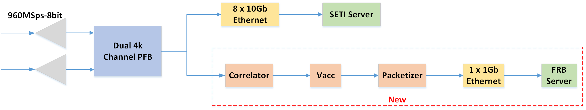
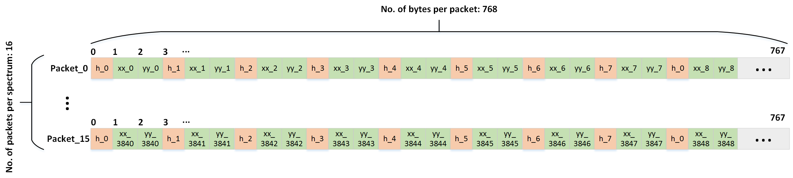

# dibas upgrade memo

To get the power data for FRBs detection when Dibas run in SETI observation mode, we made a slight firmware revise based on the original version. The FFT block signal was split to a new streamline, which include correlator, accumulator, packetizer and Ethernet data output. Due to the whole 8 ten-GbE ports were occupied by SETI data output, the FRB data will be sent through an one-GbE port. The diagram of this upgrade see figure 1. 


> fig. 1 Dibas upgrade for FRBs detection


	
* We made some changes due to compiling issues and sampling clock update 

	* We plan to lower the serendip6 valon synthesizer ADC clock from 1500 down to 960 MHz. The interleaved ADC5G board will then sample at twice that rate, at 1.92 GSps. we'll sample the L-band receiver in the second nyquist band, between 0.96 and 1.92 GHz, with a 0.19 MHz guard band on each end.  
	* For easier pass the routing and compiling, the original 12-taps PFB was changed to 4-taps, if you need more taps I will try more effort to fix it.
* Some new registers added as follows:
	* rst_cpoge, reset correlator, packetizer and one Gb Ethernet
	* sw_pps, software synchronization
	* tvg_cmult_en, test vector generator enable
	* vacc_acc_len, length of accumulation
	* vacc_shift, barrel shift, least 6-bits effective, 0~63
	* one_GbE_dest_ip, one Gb Ethernet destination IP address
	* one_GbE_dest_port, one Gb Ethernet destination port
	* one_GbE_oge_en, one Gb Ethernet enable
* The one-GbE output packet format see figure 2. 
	* Each spectrum has 16 packets, and each packet has 768 bytes of data(256 bytes header, 256 bytes power of x and 256 bytes power of y), totally 4096 channels of power x and y. Each channel of power x and y have 8 bits, and each header has 64-bits. To transmit 64 header data through a 8-bit width Ethernet, we split it to 8 parts, you need shift each bytes header data after packets receiving. You just need the first 8 bytes of header, please discard the other 248 bytes header data(we do that just because it's easier to design). 


> fig. 2 one-GbE output packets format

* If you confused about the packets format, here's some python code! :+1: 
```javascript
	# receive packets from one Gb Ethernet
	data, addr = sock.recvfrom(frame_len)
	frame_tmp = struct.unpack('<'+str(len(data))+'B',data) # unsigned char
	# split packet to header, xx, yy
	header_tmp = frame_tmp[0::3]
	xx_tmp = frame_tmp[1::3]
	yy_tmp = frame_tmp[2::3]
	# extract 8 bytes header, we just need the first 8 bytes data 
	header = header_tmp[0]+(header_tmp[1]<<8)+(header_tmp[2]<<16)+(header_tmp[3]<<24)+(header_tmp[4]<<32)+(header_tmp[5]<<40)+(header_tmp[6]<<48)+(header_tmp[7]<<56)
	SEQ = (header) >> 10 # number of packets
	CHANNEL = (header) & 0x3fff #each spectrum has 2^14 clock
	# merge 16 packets to spectrum data
	for j in range(0,frame_len/3):
        	xx[j+int(CHANNEL/4)] = xx_tmp[j]
                yy[j+int(CHANNEL/4)] = yy_tmp[j]
```
* some calculations are shown here for easy set parameters.
	* each spectrum has 12288 Bytes data, if we accumulate at 200us,  the data rate from one GbE port would be: 12288 bytes x 8 bit x 5 KHz = 0.5Gbps
	* time_samp = acc_len x 8192/clock, 
	* acc_len = time_samp x clock/8192 = 200us x 1920MHz /8192 = 46.875


All of ROACH2 firmware and boffile you can find [on GitHub](https://github.com/SparkePei/dibas-upgrade-frb).

Here is a hashpipe code for dibas frb packets receiving and filterbank data writing [dibas-hashpipe](https://github.com/SparkePei/dibas-hashpipe) 
* Set up at GBO
	* ROACH2's hostname: specdemo
	* ROACH2 mounted on asa6 server
	* Boffile location: /srv/squeeze_root.ppc/boffiles
	* commands to start up DiBAS for new greenburst version(execute from asa6): ```dibas_init.rb _0.1.5_```
	* To change back to old DiBAS version: ```dibas_init.rb _0.0.0_```
	,and then run adc calibration code: python /usr/local/bin/calibrate_adc_mmcm.py specdemo
	* ROACH2's V6 one GbE port info, IP address: 10.0.1.37, port number: 60000
	* Valon clock change to 960MHz.(Notice:change the sample clock will change the "mcount" rate, which will change the calculation from "mcount" time to "real" time.)
	* Second Nyquist sampling zone, please flip the frequency channel
* Test at GBO
	* vacc_acc_len=60,sampling time=256us
	* vacc_shift=38
	* data rate: 77640KB/s
* Notes
	* dibas_init.rb install location:/usr/local/lib/ruby/gems/2.0.0/gems/dibas-0.1.5/bin. Change this file will change the setting for dibas_init.rb _0.1.5_. current setting in this file is:fpga.vacc_acc_len = 60,fpga.vacc_shift = 38
	* check the Valon setting, run: sudo /home/jeffc/bin/valon

